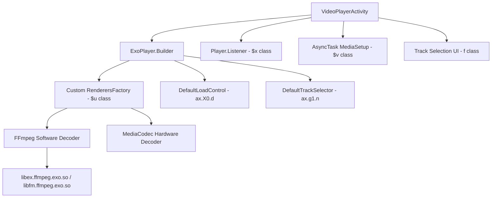

# 🎬 Phân Tích Tối Ưu Hiệu Suất Video Player Module (Code Reference)

> **Nguồn**: Decompiled từ `com.alphainventor.filemanager.viewer` — module video player của ứng dụng File Manager.
> **Framework**: Media3 ExoPlayer + FFmpeg native decoder

---

## 1. Kiến Trúc Tổng Quan



---

## 2. Các Kỹ Thuật Tối Ưu Chính

### 2.1. ExoPlayer Builder Configuration

**File**: [VideoPlayerActivity.java L832-877](file:///d:/Projects/CaNhan/nextplayer/code_reference/video_player_module/java_source/com/alphainventor/filemanager/viewer/VideoPlayerActivity.java#L832-L877)

```java
// L842-866: Khởi tạo ExoPlayer
v0_4 = new ax.g1.a$b();              // TrackSelector.Parameters.Builder
v3_2 = new ax.X0.d(this);             // DefaultLoadControl
v3_2.o(1);                             // setTargetBufferBytes(1) — buffer tối thiểu!

// Custom RenderersFactory với FFmpeg codec filtering
v5_4 = new VideoPlayerActivity$u(this, v0_4, v4_2);  // Custom RenderersFactory
v5_4.m(this.O0);  // Apply track parameters

// ExoPlayer Builder
v4_4 = new androidx.media3.exoplayer.j();  // DefaultMediaSourceFactory (obfuscated)
v5_6 = new ExoPlayer$b(this, v3_2);       // ExoPlayer.Builder(context, loadControl)
v5_6.k(this.N0);                           // setRenderersFactory(customFactory)
v5_6.h(v4_4);                             // setMediaSourceFactory
v5_6.i(10000);                            // setSeekBackIncrementMs(10000) = 10s
v5_6.j(10000);                            // setSeekForwardIncrementMs(10000) = 10s

v3_5 = v5_6.g();                          // .build()
this.W = v3_5;                            // Store ExoPlayer instance
v3_5.a(ax.X0.Y.g);                        // setAudioAttributes(DEFAULT)
```

> [!IMPORTANT]
> **Điểm tối ưu quan trọng nhất**: `DefaultLoadControl` với `setTargetBufferBytes(1)` — buffer cực kỳ nhỏ, giúp:
> - Giảm memory footprint
> - Khởi động phát video nhanh hơn
> - Phù hợp với local playback (không cần buffer network)

### 2.2. Quản Lý Wake Mode Thông Minh

```java
// L870-873: Thiết lập WakeMode dựa trên loại media
if (!this.x1) {
    this.W.c(1);    // WAKE_MODE_LOCAL cho file local
} else {
    this.W.c(2);    // WAKE_MODE_NETWORK cho stream
}
```

> [!TIP]
> Module phân biệt rõ ràng giữa **local file** và **network stream** (`x1` flag) để áp dụng WakeMode phù hợp, tránh giữ CPU/WiFi wake lock không cần thiết.

### 2.3. FFmpeg Software Audio Decoder (Dual-Library Architecture)

**Files**: [FfmpegLibrary.java](file:///d:/Projects/CaNhan/nextplayer/code_reference/video_player_module/java_source/com/google/android/exoplayer2/ext/ffmpeg/FfmpegLibrary.java), [FfmpegDecoder.java](file:///d:/Projects/CaNhan/nextplayer/code_reference/video_player_module/java_source/com/google/android/exoplayer2/ext/ffmpeg/FfmpegDecoder.java), [a.java (FFmpeg Audio Renderer)](file:///d:/Projects/CaNhan/nextplayer/code_reference/video_player_module/java_source/com/google/android/exoplayer2/ext/ffmpeg/a.java)

**Kiến trúc Dual-Library đặc biệt:**
- `libex.ffmpeg.exo.so` — Thư viện FFmpeg chính (prefix `ex`)
- `libfm.ffmpeg.exo.so` — Thư viện FFmpeg backup (prefix `fm`)
- Tự động fallback từ `ex` sang `fm` nếu library chính không load được

**Audio codecs được hỗ trợ qua FFmpeg:**

| MIME Type | FFmpeg Decoder | Ghi chú |
|-----------|---------------|---------|
| `audio/mp4a-latm` | `aac` | AAC |
| `audio/mpeg` | `mp3` | MP3, MPEG-L1, L2 |
| `audio/ac3` | `ac3` | Dolby AC3 |
| `audio/eac3` | `eac3` | E-AC3, JOC |
| `audio/vnd.dts` | `dca` | DTS, DTS-HD |
| `audio/flac` | `flac` | FLAC |
| `audio/opus` | `opus` | Opus |
| `audio/vorbis` | `vorbis` | Vorbis |
| `audio/alac` | `alac` | Apple Lossless |
| `audio/true-hd` | `truehd` | Dolby TrueHD |
| `audio/3gpp` | `amrnb` | AMR-NB |
| `audio/amr-wb` | `amrwb` | AMR-WB |
| `audio/g711-alaw` | `pcm_alaw` | PCM A-law |
| `audio/g711-mlaw` | `pcm_mulaw` | PCM µ-law |

> [!NOTE]
> FFmpeg decoder chỉ dùng cho **audio**. Video vẫn sử dụng **MediaCodec hardware decoder**. Điều này đảm bảo phát audio format hiếm mà hardware không hỗ trợ, đồng thời video luôn được hardware-accelerated.

**Buffer output configuration:**
```java
// Non-float: buffer 65536 bytes, encoding = 2 (16-bit PCM)
// Float:     buffer 131072 bytes, encoding = 4 (32-bit float)
```

### 2.4. Custom RenderersFactory — Codec Filtering

**File**: [VideoPlayerActivity$u.java](file:///d:/Projects/CaNhan/nextplayer/code_reference/video_player_module/java_source/com/alphainventor/filemanager/viewer/VideoPlayerActivity$u.java)

```java
class VideoPlayerActivity$u extends ax.g1.n {  // extends DefaultRenderersFactory
    String m;  // preferred codec name

    // Override codec selection
    protected Pair c0(G$a codecInfo, int[][][] capabilities, n$e parameters, String preferredCodec) {
        Pair result = super.c0(codecInfo, capabilities, parameters, preferredCodec);
        
        // Kiểm tra trạng thái T1 và S1 (error flags)
        if (VideoPlayerActivity.Q()) {
            if (VideoPlayerActivity.S()) return null;  // Disable nếu cả 2 flag lỗi
        } else {
            // Filtering codec: chỉ chọn codec có tên khớp preferred
            if (!TextUtils.isEmpty(this.m) && formats != null) {
                boolean hasMatch = false;
                for (int i = 0; i < formats.a; i++) {
                    if (g0(formats.b(i), this.m)) hasMatch = true;
                }
                if (!hasMatch) return null;  // Loại bỏ codec không khớp
            }
        }
        return result;
    }
}
```

> [!IMPORTANT]
> **Preferred Codec Selection**: Cho phép user chọn codec cụ thể (ví dụ: `c2.android.avc.decoder` thay vì `OMX.qcom.video.decoder.avc`). Module lưu preference và filter codec list theo tên, loại bỏ codec không mong muốn. Đây là lý do app có thể "force" hardware decoder cụ thể để đạt hiệu suất tốt nhất trên từng thiết bị.

### 2.5. Track Selection & Subtitle Management

**File**: [f.java (Track Selection UI)](file:///d:/Projects/CaNhan/nextplayer/code_reference/video_player_module/java_source/com/alphainventor/filemanager/viewer/f.java)

- Hỗ trợ chọn audio track và subtitle track
- Sử dụng `TrackSelectionParameters` API mới của Media3
- Auto-select subtitle đầu tiên khi có
- Disable subtitle qua `setRendererDisabled(3, true)` và `setMaxVideoSize(-3)` (TEXT renderer index = 3)

### 2.6. Player State Machine & Error Recovery

**File**: [VideoPlayerActivity$x.java (Player.Listener)](file:///d:/Projects/CaNhan/nextplayer/code_reference/video_player_module/java_source/com/alphainventor/filemanager/viewer/VideoPlayerActivity$x.java)

| State | Hành vi |
|-------|---------|
| `STATE_READY (3)` | Ghi analytics, setup progress bar, auto-hide timer |
| `STATE_BUFFERING (2)` | Hiển thị buffering indicator |
| `STATE_ENDED (4)` | Auto-play next hoặc hiển thị completion |
| `onTracksChanged` | Detect codec không khả dụng → log + report |
| `onPlayerError` | Check recoverable error → retry hoặc next video |

**Codec Error Handling:**
```java
// Khi track không available:
// - Video codec not available → log + analytics event
// - Audio codec not available → log + analytics event
// - Text track → auto-select nếu có embedded subtitle
```

### 2.7. Adaptive Playback Speed UI

**File**: [d.java](file:///d:/Projects/CaNhan/nextplayer/code_reference/video_player_module/java_source/com/alphainventor/filemanager/viewer/d.java)

Hỗ trợ 8 mức tốc độ: `0.25x, 0.5x, 0.75x, 1x, 1.25x, 1.5x, 1.75x, 2x`

> [!NOTE]
> Giá trị tốc độ lưu dưới dạng **IEEE 754 float raw bits** (int representation):
> - `1065353216` = `1.0f`
> - `1056964608` = `0.5f`
> - `1073741824` = `2.0f`

### 2.8. Gesture Controls (Seek, Volume, Brightness)

**File**: [VideoPlayerActivity$f.java (GestureDetector)](file:///d:/Projects/CaNhan/nextplayer/code_reference/video_player_module/java_source/com/alphainventor/filemanager/viewer/VideoPlayerActivity$f.java)

| Gesture | Hành động |
|---------|----------|
| Double-tap trái (< 1/3 width) | Seek backward |
| Double-tap phải (> 2/3 width) | Seek forward |
| Double-tap giữa | Play/Pause toggle |
| Swipe ngang | Seek (40s mỗi 360dp) |
| Swipe dọc trái | Brightness control |
| Swipe dọc phải | Volume control |
| Long press | Speed boost |
| Pinch zoom | Scale/aspect ratio |

**Seek calculation**: `seekPosition = currentPos + (deltaX * 40000 / 360)` — 40 giây cho mỗi 360dp swipe.

### 2.9. Async Media Loading

**File**: [VideoPlayerActivity$v.java (AsyncTask)](file:///d:/Projects/CaNhan/nextplayer/code_reference/video_player_module/java_source/com/alphainventor/filemanager/viewer/VideoPlayerActivity$v.java)

- Media source được chuẩn bị trên background thread (AsyncTask)
- Hiển thị loading indicator trong quá trình chuẩn bị
- Player.prepare() và play() chạy trên main thread sau khi AsyncTask hoàn thành
- Handle `IllegalStateException` gracefully

---

## 3. So Sánh Với NextPlayer Hiện Tại

| Thông số | Module Cũ (FileManager) | NextPlayer |
|----------|------------------------|------------|
| **LoadControl** | `setTargetBufferBytes(1)` — buffer tối thiểu | DefaultLoadControl mặc định |
| **FFmpeg** | Dual-library (ex + fm), audio-only | Media3 FFmpeg extension |
| **Codec Selection** | Custom filter theo tên codec | Mặc định Media3 |
| **Wake Mode** | Phân biệt LOCAL vs NETWORK | Cần kiểm tra |
| **Seek Increment** | 10s cố định | Configurable |
| **Error Recovery** | Detailed codec logging + fallback | Cần kiểm tra |
| **Gesture** | Full swipe seek/volume/brightness | Đã implement |
| **Playback Speed** | 8 mức (0.25x-2x) | Đã implement |
| **Surface** | SurfaceView (hardware compositing) | PlayerView mặc định |

---

## 4. Kết Luận & Khuyến Nghị

### Những điểm tối ưu đáng học hỏi:

1. **Buffer tối thiểu cho local playback** — `setTargetBufferBytes(1)` giúp khởi động nhanh và tiết kiệm RAM
2. **Preferred codec selection** — Cho phép chọn hardware decoder cụ thể, hữu ích trên thiết bị có nhiều decoder
3. **Dual FFmpeg library** — Fallback mechanism cho native decoder, tăng tính ổn định
4. **Wake Mode phân biệt** — Tránh giữ wake lock không cần thiết cho local files
5. **Async media preparation** — Không block UI thread khi chuẩn bị media source
6. **Detailed codec error logging** — Analytics và logging chi tiết khi codec không khả dụng

### Điểm lưu ý:

> [!WARNING]
> - Code rất obfuscated, một số mapping có thể không chính xác 100%
> - `setTargetBufferBytes(1)` có thể gây stutter trên video bitrate cao hoặc device yếu
> - Dual FFmpeg library tăng APK size nhưng cải thiện compatibility
