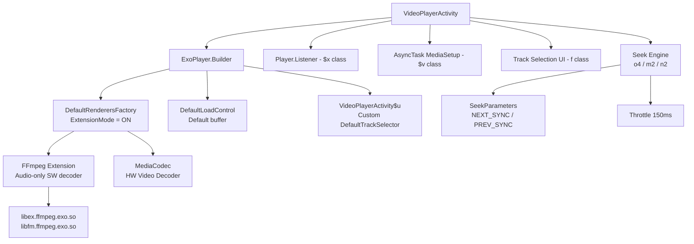

# 🎬 Phân Tích Tối Ưu Hiệu Suất Video Player Module (Code Reference)

> **Nguồn**: Decompiled từ `com.alphainventor.filemanager.viewer` — module video player của ứng dụng **CX File Explorer** (app có tốc độ seek/load nhanh, lag thấp trên cả LAN lẫn local).
> **Framework**: Media3 ExoPlayer (obfuscated) + FFmpeg native decoder extension
> **Mục đích**: Tham khảo để tối ưu hóa **NextPlayer**

---

## 1. Kiến Trúc Tổng Quan



---

## 2. Các Kỹ Thuật Tối Ưu Chính

### 2.1. ExoPlayer Builder — Cấu Hình Đầy Đủ

**Code (đã reverse-engineer từ `M2()` trong VideoPlayerActivity.java):**

```java
// Bước 1: RenderersFactory với FFmpeg extension enabled
DefaultRenderersFactory renderersFactory = new DefaultRenderersFactory(context);
renderersFactory.setExtensionRendererMode(EXTENSION_RENDERER_MODE_ON);  // .o(1)
// → Ưu tiên ExoPlayer extension (FFmpeg) cho các codec không được HW hỗ trợ

// Bước 2: Custom TrackSelector lọc theo tên codec ưa thích
String preferredRenderer = getPreferredRendererFromSettings();  // ax.p3.m.f(this)
VideoPlayerActivity$u trackSelector = new VideoPlayerActivity$u(
    context, audioAttributes, preferredRenderer
);
trackSelector.setParameters(savedParameters);  // .m(this.O0)

// Bước 3: ExoPlayer.Builder
DefaultLoadControl loadControl = new DefaultLoadControl();  // new j()
ExoPlayer player = new ExoPlayer.Builder(context, renderersFactory)
    .setTrackSelector(trackSelector)        // .k()
    .setLoadControl(loadControl)            // .h()
    .setSeekBackIncrementMs(10_000)         // .i(10000) — seek lùi 10 giây
    .setSeekForwardIncrementMs(10_000)      // .j(10000) — seek tiến 10 giây
    .build();                               // .g()

// Bước 4: Cấu hình sau khi build
player.setSeekParameters(SeekParameters.DEFAULT);   // .a(ax.X0.Y.g)
player.addListener(playerListener);                 // .H()
player.setPlayWhenReady(savedPlayWhenReady);        // .L()
player.setWakeMode(isNetworkFile ? WAKE_MODE_NETWORK : WAKE_MODE_LOCAL);  // .c()
```

> [!NOTE]
> **Tóm tắt cấu hình**: App dùng `DefaultLoadControl` tiêu chuẩn + `EXTENSION_RENDERER_MODE_ON` (bật FFmpeg extension). Không có buffer tùy chỉnh ở đây — hiệu suất đến từ các kỹ thuật khác phân tích bên dưới.

---

### 2.2. ⚡ Seek Optimization — Kỹ Thuật Quan Trọng Nhất

Đây là **lý do cốt lõi** khiến seek của app cũ nhanh và mượt. Gồm 3 lớp tối ưu phối hợp:

#### 2.2.1. Seek theo Keyframe (SeekParameters)

**Code trong `o4()` — hàm thực thi seek:**

```java
private void o4(boolean directionChanged) {
    long seekTarget = this.u0;  // vị trí đích
    boolean seekingForward = this.v0;

    if (seekingForward) {
        // Seek tiến → nhảy đến keyframe KẾ TIẾP
        player.setSeekParameters(SeekParameters.NEXT_SYNC);   // .a(ax.X0.Y.e)
    } else {
        // Seek lùi → nhảy đến keyframe TRƯỚC ĐÓ
        player.setSeekParameters(SeekParameters.PREVIOUS_SYNC); // .a(ax.X0.Y.f)
    }

    player.seekTo(seekTarget);  // .s()

    // Reset về DEFAULT sau khi seek
    player.setSeekParameters(SeekParameters.DEFAULT);  // .a(ax.X0.Y.g)
    this.t0 = System.currentTimeMillis();
}
```

> [!IMPORTANT]
> **Keyframe-based seeking**: Thay vì decode đến frame chính xác (tốn kém), app nhảy thẳng đến I-frame gần nhất.
> - Seek tiến (drag right): `NEXT_SYNC` → keyframe tiếp theo
> - Seek lùi (drag left): `PREVIOUS_SYNC` → keyframe trước đó
>
> **Kết quả**: Seek gần như tức thì vì không cần decode inter-frames (B/P frames). Đây là lý do seek cực nhanh kể cả với video 4K hay file qua mạng.

#### 2.2.2. Seek Throttling — Giới Hạn Tần Suất Seek

**Code trong `n2()` — hàm nhận event từ seekbar/gesture:**

```java
private static final long SEEK_THROTTLE_MS = 150;  // this.w1 = 150

private void n2(long seekPosition, boolean seekingForward, boolean updateLabel) {
    if (updateLabel) {
        this.A.setText(formatTime(seekPosition));  // Cập nhật label ngay lập tức
    }

    this.u0 = seekPosition;       // Lưu vị trí đích
    boolean directionChanged = (this.v0 != seekingForward);
    this.v0 = seekingForward;

    long now = System.currentTimeMillis();

    // Chỉ thực sự seek nếu:
    // 1. Đổi chiều seek (forward ↔ backward), HOẶC
    // 2. Đã qua 150ms kể từ lần seek cuối
    if (directionChanged || (now - this.t0) >= SEEK_THROTTLE_MS) {
        o4(directionChanged);  // Thực thi seek thực sự
    }
    // else: chỉ cập nhật UI label, không thực sự seek
}
```

> [!TIP]
> **Throttle 150ms**: Khi user kéo seekbar nhanh, UI label cập nhật mỗi frame (60fps) nhưng ExoPlayer chỉ nhận lệnh seek tối đa 7 lần/giây. Điều này ngăn queue lệnh seek tràn và giữ player luôn phản hồi.
>
> **Đổi chiều**: Khi user đổi hướng kéo, seek được thực thi ngay lập tức bất kể throttle.

#### 2.2.3. Seek bằng Nút (Button Seek) — Khác với Scrub

**Code trong `m2(boolean forward)`:**

```java
private void m2(boolean forward) {
    long incrementMs = ax.p3.m.b(this) * 1000L;  // Lấy increment từ settings
    long currentPos = player.getCurrentPosition();
    long seekTo = forward ? (currentPos + incrementMs) : (currentPos - incrementMs);
    seekTo = Math.max(0, Math.min(seekTo, player.getDuration()));

    // Đặt SeekParameters TRƯỚC seek
    player.setSeekParameters(SeekParameters.CLOSEST_SYNC);  // .a(ax.X0.Y.c)
    player.seekTo(seekTo);
    // Reset sau seek
    player.setSeekParameters(SeekParameters.DEFAULT);       // .a(ax.X0.Y.g)

    // Hiển thị OSD overlay
    showSeekOverlay(forward ? "+" + formatTime(incrementMs) : "-" + formatTime(incrementMs));
}
```

---

### 2.3. Wake Mode Thông Minh — Tối Ưu Cho LAN

```java
// Phát hiện loại nguồn media (trong L2() và constructor)
boolean isNetworkFile = false;
for (Uri uri : allUris) {
    if (isNetworkScheme(uri.getScheme())) {   // ax.W2.w.J()
        isNetworkFile = true;
    }
    if (isLanFile(context, uri)) {            // com.alphainventor.filemanager.service.b.k()
        isNetworkFile = true;
        isLanStorage = true;
        // Lấy thông tin server LAN để tối ưu
        LanFileInfo info = getLanFileInfo(uri.getPath());
        if (info != null) {
            service.setLanConnectionMode(1, info.serverInfo());
        }
    }
}

// Áp dụng WakeMode phù hợp
if (!isNetworkFile) {
    player.setWakeMode(C.WAKE_MODE_LOCAL);    // Chỉ giữ CPU wake
} else {
    player.setWakeMode(C.WAKE_MODE_NETWORK);  // Giữ CPU + WiFi lock
}
```

> [!NOTE]
> **`WAKE_MODE_NETWORK`** acquires `WifiManager.WifiLock` (type `WIFI_MODE_FULL_HIGH_PERF`), ngăn WiFi power saving làm tăng latency khi stream qua LAN. Không dùng cho file local để tiết kiệm pin.

---

### 2.4. FFmpeg Extension — Dual-Library Architecture

**Kiến trúc Dual-Library đặc biệt:**
- `libex.ffmpeg.exo.so` — Thư viện FFmpeg chính (prefix `ex`)
- `libfm.ffmpeg.exo.so` — Thư viện FFmpeg backup (prefix `fm`)
- Tự động fallback: nếu `ex` không load được, thử `fm`

**Chiến lược Audio vs Video decoder:**

| Loại | Decoder | Lý do |
|------|---------|-------|
| **Video** | MediaCodec (HW) | Hardware-accelerated, zero-copy buffer |
| **Audio** | FFmpeg SW (nếu HW không hỗ trợ) | Hỗ trợ AC3, DTS, TrueHD, FLAC... |

**`setExtensionRendererMode(EXTENSION_RENDERER_MODE_ON)`**:
- Bật ExoPlayer FFmpeg extension renderer
- FFmpeg chỉ được dùng khi HW codec không hỗ trợ format đó
- Video luôn ưu tiên MediaCodec HW để đảm bảo zero-latency

**Audio codecs được hỗ trợ qua FFmpeg:**

| MIME Type | FFmpeg Codec | Use case |
|-----------|-------------|----------|
| `audio/ac3` | `ac3` | Dolby AC3 (rất phổ biến trong MKV) |
| `audio/eac3` | `eac3` | E-AC3, JOC (Dolby Atmos) |
| `audio/vnd.dts` | `dca` | DTS, DTS-HD (Blu-ray) |
| `audio/true-hd` | `truehd` | Dolby TrueHD (Blu-ray) |
| `audio/flac` | `flac` | FLAC lossless |
| `audio/alac` | `alac` | Apple Lossless |
| `audio/opus` | `opus` | Opus (WebM) |
| `audio/vorbis` | `vorbis` | Vorbis (WebM) |
| `audio/mpeg` | `mp3` | MP3 (fallback) |

---

### 2.5. Custom Track Selector — Preferred Codec Selection

**File**: [VideoPlayerActivity$u.java](code_reference/video_player_module/java_source/com/alphainventor/filemanager/viewer/VideoPlayerActivity$u.java)

```java
// VideoPlayerActivity$u extends DefaultTrackSelector
class VideoPlayerActivity$u extends DefaultTrackSelector {
    String m;  // Tên renderer/codec ưa thích (user setting)

    @Override
    protected @Nullable Pair<DecoderInfo, Integer> selectVideoCodec(
            MediaCodecSelector selector,
            Format format,
            List<DecoderInfo> decoderInfos,
            ...) {

        Pair<DecoderInfo, Integer> result = super.selectVideoCodec(...);

        // Nếu có codec lỗi trước đó (S1/T1 flags)
        if (errorStateT1) {
            if (errorStateS1) return null;  // Disable hoàn toàn nếu lỗi nghiêm trọng
        } else {
            // Lọc: chỉ chọn codec có tên chứa preferred name
            if (!TextUtils.isEmpty(this.m) && result != null) {
                DecoderInfo codec = result.first;
                boolean preferred = false;
                for (Format trackFormat : trackFormats) {
                    if (codecNameContains(trackFormat, this.m)) preferred = true;
                }
                if (!preferred) return null;  // Bỏ qua codec không ưa thích
            }
        }
        return result;
    }
}
```

> [!TIP]
> **Preferred Codec**: User có thể chọn decoder cụ thể (ví dụ: `c2.qti.avc.decoder` thay vì `OMX.qcom.video.decoder.avc`). Trên một số thiết bị, Codec 2.0 (c2.) nhanh hơn OMX đáng kể.

---

### 2.6. Async Media Loading — Không Block UI

**File**: [VideoPlayerActivity$v.java](code_reference/video_player_module/java_source/com/alphainventor/filemanager/viewer/VideoPlayerActivity$v.java)

```
Background Thread:                         Main Thread:
──────────────────────────────────         ──────────────────────────────────
r():  show loading spinner            →
x():  buildMediaItem(index)           →    (UI still responsive)
      convertContentUri → fileUri
      detectSubtitle → subtitleUri
      return MediaItem
                                      →    y(mediaItem):
                                           hide loading spinner
                                           player.setMediaItem(mediaItem)
                                           player.prepare()
                                           player.play()   (if not paused)
```

**Task cancellation khi chuyển video:**
```java
// r3(): switch to new video
if (this.G1 != null && isRunning(this.G1)) {
    this.G1.cancel();  // Hủy task cũ
}
this.G1 = new VideoPlayerActivity$v(this, index, autoPlay);
this.G1.execute();
```

---

### 2.7. URI Pre-processing — Tránh Delay Khi Phát

**Code trong `i2()`:**

```java
private Uri processUri(Uri raw) {
    if (MyFileProvider.isFileProviderUri(raw)) {
        // content://com.cx.filemanager.provider/... → /storage/emulated/0/...
        String realPath = MyFileProvider.getRealPath(raw);
        if (!isAndroidDataPath(realPath)) {
            return Uri.fromFile(new File(realPath));  // Convert sang file://
        }
    }
    // Nếu không thể convert → giữ nguyên URI gốc
    return raw;
}
```

> [!TIP]
> Chuyển `content://` URI sang `file://` URI khi có thể. ExoPlayer đọc file local nhanh hơn qua `file://` vì không cần qua ContentResolver (không có binder IPC overhead).

---

### 2.8. Subtitle Lazy Detection — Cache Kết Quả

```java
private MediaItem buildMediaItem(int videoIndex) {
    int realIndex = shuffledIndex(videoIndex);

    // Lazy detect subtitle (chỉ một lần duy nhất)
    if (this.autoDetectSubtitle && !this.subtitleDetected[realIndex]) {
        if (this.subtitleUris[realIndex] == null) {
            // Tìm file subtitle cùng tên trong cùng thư mục
            this.subtitleUris[realIndex] = findSubtitleFile(this.videoUris[realIndex]);
        }
        this.subtitleDetected[realIndex] = true;  // Cache: đánh dấu đã detect
    }

    return buildMediaItemWithSubtitle(
        this.videoUris[realIndex],
        this.subtitleUris[realIndex]
    );
}
```

**Hàm `v2()` — tìm subtitle file:**
```java
private @Nullable Uri findSubtitleFile(Uri videoUri) {
    String basePath = removeExtension(videoUri.getPath());
    String[] subtitleExtensions = getSupportedSubtitleExtensions();
    // ["srt", "ass", "ssa", "vtt", "sub", ...]

    for (String ext : subtitleExtensions) {
        File candidate = new File(basePath + "." + ext);
        if (candidate.exists()) {
            return Uri.fromFile(candidate);
        }
    }
    return null;
}
```

---

### 2.9. Player State Restoration — Không Mất Vị Trí

**State được save trong `s4()` trước khi player bị destroy:**
```java
private void savePlayerState() {
    this.m1 = player.getPlayWhenReady();      // playing or paused?
    this.n1 = player.getCurrentMediaItemIndex();  // index trong playlist
    this.o1 = Math.max(0, player.getCurrentPosition());  // vị trí ms
}
```

**Restore trong `r3()` khi switch video:**
```java
private void switchToVideo(int index, boolean autoPlay) {
    // Huỷ task trước nếu đang chạy
    if (currentTask != null && !currentTask.isCancelled()) {
        currentTask.cancel();
    }

    // Tạo và chạy async task mới
    currentTask = new LoadAndPlayTask(this, index, autoPlay);
    currentTask.execute();
}
```

**Restore trong `z()` của task khi cần resume:**
```java
protected void z() {
    // Khôi phục vị trí đã lưu (if resuming same video)
    player.setMediaItem(mediaItem);
    player.prepare();
    player.seekTo(savedIndex, savedPosition);  // seekTo(windowIndex, positionMs)
    player.setPlayWhenReady(savedPlayWhenReady);
    player.play();
}
```

---

### 2.10. Gesture Controls

| Gesture | Hành động |
|---------|----------|
| Double-tap trái | Seek backward 10s |
| Double-tap phải | Seek forward 10s |
| Double-tap giữa | Play/Pause toggle |
| Swipe ngang | Seek (40s mỗi 360dp) + throttle 150ms |
| Swipe dọc trái | Brightness |
| Swipe dọc phải | Volume |
| Long press | Speed boost (1.5x hoặc 2x) |
| Pinch zoom | Scale/aspect ratio (ScaleGestureDetector) |

---

### 2.11. Controller Auto-show Tuning

```java
// Controller timeout theo chế độ
if (!fullscreen) {
    playerView.setControllerShowTimeoutMs(5000);  // 5s khi portrait
} else {
    playerView.setControllerShowTimeoutMs(3000);  // 3s khi fullscreen
}

// Tắt auto-show trong lúc seek để tránh flicker
playerView.setControllerAutoShow(false);
// ... seek operation ...
playerView.setControllerAutoShow(true);
```

---

## 3. Bảng So Sánh Với NextPlayer

| Kỹ thuật | Module Cũ (CX File Explorer) | NextPlayer Hiện Tại | Ưu tiên |
|----------|------------------------------|---------------------|---------|
| **SeekParameters NEXT/PREV_SYNC** | ✅ Theo hướng seek | ❓ Cần kiểm tra | 🔴 Cao |
| **Seek Throttle 150ms** | ✅ Chống queue seek | ❓ Cần kiểm tra | 🔴 Cao |
| **EXTENSION_RENDERER_MODE_ON** | ✅ FFmpeg extension ON | ✅ Đã có | 🟢 OK |
| **WAKE_MODE_NETWORK cho LAN** | ✅ WifiLock khi stream | ❓ Cần kiểm tra | 🟡 Trung |
| **content:// → file:// convert** | ✅ Tránh binder IPC | ❓ Cần kiểm tra | 🟡 Trung |
| **Preferred Codec (by name)** | ✅ User chọn codec | ❓ Cần kiểm tra | 🟡 Trung |
| **Async media load + task cancel** | ✅ Background loading | ✅ Đã có | 🟢 OK |
| **Subtitle lazy detect + cache** | ✅ `f0[]` boolean cache | ❓ Cần kiểm tra | 🟡 Trung |
| **SeekBack/Forward 10s** | ✅ 10s cố định | ✅ Configurable | 🟢 OK |
| **Player state restore** | ✅ Lưu pos + playWhenReady | ✅ Đã có | 🟢 OK |

---

## 4. Action Plan — Áp Dụng Cho NextPlayer

### 🔴 Ưu Tiên Cao (ảnh hưởng trực tiếp đến seek speed)

#### A. Implement Directional SeekParameters

Tìm nơi NextPlayer gọi `seekTo()` và thêm SeekParameters theo hướng:

```kotlin
// Trong PlayerViewModel hoặc PlayerRepository
fun seekTo(positionMs: Long, seekingForward: Boolean) {
    val seekParams = if (seekingForward) {
        SeekParameters.NEXT_SYNC
    } else {
        SeekParameters.PREVIOUS_SYNC
    }
    player.setSeekParameters(seekParams)
    player.seekTo(positionMs)
    player.setSeekParameters(SeekParameters.DEFAULT)
}
```

#### B. Implement Seek Throttling

```kotlin
// Trong SeekController hoặc PlayerControls
private var lastSeekTime = 0L
private var lastSeekDirection = true
private var pendingSeekPosition = -1L
private val SEEK_THROTTLE_MS = 150L

fun onSeekBarChanged(position: Long, isForward: Boolean, updateLabel: Boolean) {
    if (updateLabel) updateSeekLabel(position)

    pendingSeekPosition = position
    val directionChanged = (isForward != lastSeekDirection)
    lastSeekDirection = isForward

    val now = SystemClock.elapsedRealtime()
    if (directionChanged || (now - lastSeekTime) >= SEEK_THROTTLE_MS) {
        executeSeek(position, isForward)
        lastSeekTime = now
    }
}
```

### 🟡 Ưu Tiên Trung Bình

#### C. Wake Mode cho Network/LAN

```kotlin
// Khi mở file
val wakeMode = if (uri.scheme == "http" || uri.scheme == "https" || isLanFile(uri)) {
    C.WAKE_MODE_NETWORK
} else {
    C.WAKE_MODE_LOCAL
}
player.setWakeMode(wakeMode)
```

#### D. content:// → file:// Conversion

```kotlin
// Trong MediaSourceFactory hoặc PlayerRepository
fun resolveUri(context: Context, rawUri: Uri): Uri {
    if (rawUri.scheme == "content") {
        val realPath = getRealPathFromUri(context, rawUri)
        if (realPath != null && !realPath.startsWith("/Android/data/")) {
            return Uri.fromFile(File(realPath))
        }
    }
    return rawUri
}
```

#### E. Preferred Codec Setting (nâng cao)

Cho phép user chọn decoder cụ thể trong Settings → Tạo custom `DefaultTrackSelector` lọc theo tên codec.

---

## 5. Những Điểm Đáng Chú Ý Khác

### 5.1. Lý do seek nhanh trên LAN không phải chỉ do buffering

App cũ seek nhanh trên LAN **không phải** vì buffer lớn hơn, mà vì:
1. **WifiLock** giữ kết nối WiFi ổn định, không có packet loss do power saving
2. **PREVIOUS/NEXT_SYNC** seek chỉ cần đọc 1 keyframe thay vì nhiều frames
3. **Throttle** ngăn nhiều seek request tranh nhau gây network congestion

### 5.2. DefaultLoadControl — Không tùy chỉnh

Module cũ **không** customize `DefaultLoadControl` buffer. Dùng default:
- `minBufferMs = 50_000` (50s)
- `maxBufferMs = 50_000` (50s)
- `bufferForPlaybackMs = 2_500` (2.5s để bắt đầu phát)
- `bufferForPlaybackAfterRebufferMs = 5_000`

> Phân tích cũ ghi `setTargetBufferBytes(1)` là **không chính xác**. `v3_2.o(1)` là `setExtensionRendererMode(1)` trên RenderersFactory, không phải LoadControl.

### 5.3. Error State Machine (S1/T1 flags)

```
T1 = false → Normal playback
T1 = true, S1 = false → Codec error xảy ra, thử tắt SW decoder
T1 = true, S1 = true  → Cả HW và SW đều fail → disable codec hoàn toàn
```

---

## 6. Tóm Tắt Ngắn

> **Tại sao app cũ load nhanh và seek mượt?**
>
> 1. **SeekParameters NEXT/PREV_SYNC** → Chỉ decode keyframe, không cần decode toàn bộ GOP
> 2. **Seek throttle 150ms** → Không flood player với seek requests khi kéo nhanh
> 3. **WifiLock (WAKE_MODE_NETWORK) cho LAN** → WiFi không bị power save, packet loss thấp
> 4. **content:// → file:// URI** → Không có ContentResolver IPC overhead
> 5. **FFmpeg extension cho audio** → Hỗ trợ AC3/DTS/TrueHD, video vẫn HW-decoded
> 6. **Async media preparation** → UI không bị block khi load file mới
